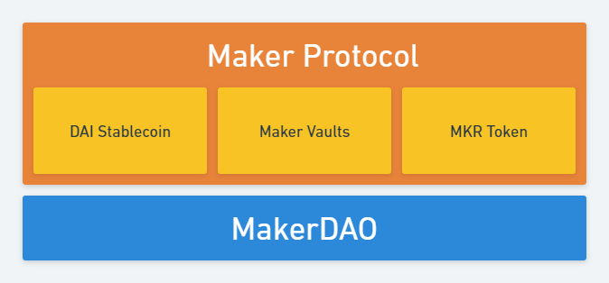

# The Maker Protocol

## What is the Maker Protocol?

The Maker Protocol is a set of modular [smart contracts](https://ethereum.org/en/smart-contracts/) that exist primarily on the Ethereum blockchain. 

These contracts define the following (non-exhaustive):
* The DAI Stablecoin 
* The MKR token
* The Maker Vault Engine
* The interactions between these elements that result in a stable system.

## How does the Maker Protocol Work?

Actions that affect the Maker Protocol are either permissionless or permissioned. Permissionless actions can be performed by any entity interacting with the Ethereum blockchain. Permissioned actions can only be performed by the governance smart contract after a successful vote by MKR Holders.  

Permissionless actions in the Maker Protocol include things like:
* Opening a Maker Vault according to the rules of the Maker Protocol.
* Calling necessary maintenance functions.
* Liquidating a vault user according to the rules of the Maker Protocol.

Permissioned actions taken by Maker Governance include things like:
* Changing the risk parameters on a certain class of vault.
* Adjusting liquidation and auction parameters.
* Transferring DAI owned by the Maker Protocol.
* Upgrading or replacing some parts of the Maker Protocol.

Users of DAI or Vaults have permissioned access to the DAI and Vaults that they own, but no access to DAI or Vaults owned by other users.  

No entity or individual has permission or direct control over any aspect of the Maker Protocol.  

## How does this fit in with our other concepts?

The DAI Stableconi, MKR token and Maker Vaults are all a part of the Maker Protocol.  

The Maker Protocol is governed by MKR Token Holders.  

MakerDAO is the group of individuals and entities that own the MKR token and/or operate, maintain and improve the Maker Protocol.  

